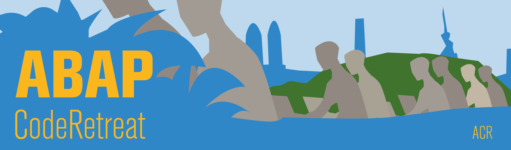

## ABAP Community Events
[**Code Retreat**](#abap-coderetreat)
&nbsp;·&nbsp;
[**Bunkai**](#abapgit-bunkai)

In recent years, several ABAP Community Events have evolved. Every ABAP Community Event Format is structured to help attendees share knowledge, to learn new SAP technologies together, and to hone their skills.

ABAP Community Events are not conferences! The rules are different, and attendees actively take part in the coding experience: no passive lectures, only active participation. 
ABAP Community Events are **full day** (usually from 9 a.m.-5 p.m.) intensive practice events, focusing on the fundamentals of software development, modern ABAP, and design – away from the pressures of “getting things done.”

We try to focus even more on the craftsmanship, even more on one Programming language which is ABAP. In order to dive even deeper and find out more about how to become better. Our mantra becomes **ABAPIsNotDead**[^1].

The events are organised by the community, low-cost, often sponsored or even free for attendees, and very informal. Anyone who is interested may participate.

### Upcoming Events are organized via Meetup
- [Meetup Group ABAP Community](https://www.meetup.com/de-DE/abap-community/)

---

## ABAP CodeRetreat
‌
The ABAP CodeRetreat was the first event format in this category. It was invented by Damir Majer and Prof. Dr. Christian Drumm, who adapted this format from the Code Retreat Format. 

### What is it?
This FREE Community-Driven event gives the opportunity to practice TDD, Clean Code and Refactoring using ABAP Development Tools (aka. ABAP in Eclipse) for a whole day. This isn’t a conference! Rules are totally different, attendees take actively part in the coding experience: act a lot, listen very little.

### CodeRetreat?
„Retreats” are certainly in trend. Many people would be thinking of a spiritual retreat as in a monastery. But we programmers also know the term: A CodeRetreat is an established, proven learning format in which you focus without having time pressure entirely on the programming and good code design. To improve the way you work and deepen your existing knowledge – all that, without thinking of your current project and its impending deadlines. The Inventor of the CodeRetreats is Corey Haines. Additional Information could be found on his site http://coderetreat.org/.

### The Set-up of a CodeRetreat
A Code-Retreat usually takes place in one day. This will be divided in five to six 45 minutest programming sessions or better said Code-Katas. Between each session there is a15 minutes break for a review, a coffee break and a briefing of the next meeting. In the morning you will familiarise yourselves with the problem to break with old habits. In the afternoon it will become more demanding: We will make your abstraction and test your ability for test-driven development. Instead of gaining new insights, you will spend the day to practicing these concepts.

### Kata
The word “Kata” stands for the problem you’re going to solve over and over again, dealing with different constraints in each session. This short exercise were first introduced by Dave Thomas. Basically, this will be your coding challenge of the day. All locations share the same Kata, and the Kata we chose differs from event to event. You’ll get more and more familiar with the Kata as time goes by: by the end of the day you’ll clean-code as a PRO!

### Pair-Programming
As a work method we generally use Pair-Programming as the knowledge transfer is an essential part of this exercise. In each session you will work with different partner, select a part of the problem to be solved and begin the test-driven development. After each session you will delete the developed code (completely!) and exchange information with the other participants over the learned lessons. If you work together with others and have fun on the set tasks, the learning effect will automatically occur!

### What should I bring?
Just bring your laptop, if possible have your own access to a NetWeaver Stack (on premise or cloud). 

### Who supports ABAP CodeRetreats?
The ABAP CodeRetreat Format is founded and supported by [Damir Majer](http://scn.sap.com/people/damir.majer) and [Dr. Christian Drumm](http://scn.sap.com/people/christian.drumm) .

## ABAP BunKai
‌
With the Bunkai Formats we like to have a Deep Dive on much more narrow topics. Here we begin with Git and the Client ABAPGit.

### ABAPGit Bunkai
The second Community event format is ABAPGit BunKai, which was founded by and is supported by Christian Günter, Prof. Dr. Christian Drumm, Damir Majer, Sascha Junkert and Johannes Konings. This event is a deep dive into different topics, giving attendees the opportunity to practice Git foundations, branching, pull and push requests, collaboration with Git and best practices, using version control and related tools and frameworks to support continuous testing, continuous collaboration, and related topics for the entire day.

---

## Facilitation
Beginning in 2019 the format will evolve. This means that Christian and Damir will facilitate eight events per year (4 in Germany and 4 outside Germany). Everyone from the community is highly welcomed to organise and moderate a CodeRetreat. Don’t hesitate to contact us if you’re like to organise on yourself an Event, and need support related to that!

## Communication
As an ABAP Community, we use Slack Collaboration Tool. You’re welcome to join our [ABAP Community Slack channel](https://join.slack.com/t/abapcommunity/shared_invite/enQtNTA3ODQwNTExMzE3LTVjMTZhNDBjMmYxYWFkZWY4N2ZiNTJhNTM5MjZlNDcyMzgyYWZkNGM2ZjFkMjRjYWE2NTBmYzdhZDhjZmFhZTE).

Interested in hosting an even? Get in contact with one of the facilitators or send us a message via Twitter

- [@ABAPCodeRetreat](https://twitter.com/ABAPCodeRetreat?lang=de)
- [@majcon](https://twitter.com/majcon)
- [ceedee666](https://twitter.com/ceedee666)

## Websites on the SAP Community Network
- [ABAP CodeRetreat Wiki](https://wiki.scn.sap.com/wiki/display/events/ABAP+CodeRetreat)
- [ABAPGitBunKai Wiki](https://wiki.scn.sap.com/wiki/display/events/abapGit+BunKai)

## Footnotes
[^1]: heard the first time Uwe Fetzer using this Term
